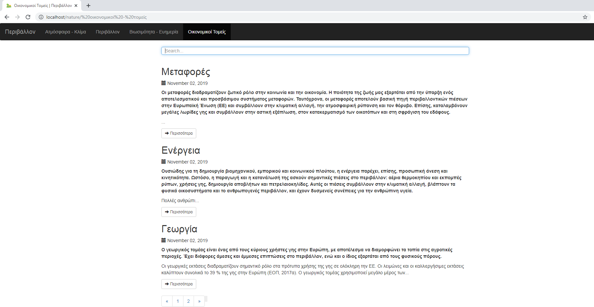
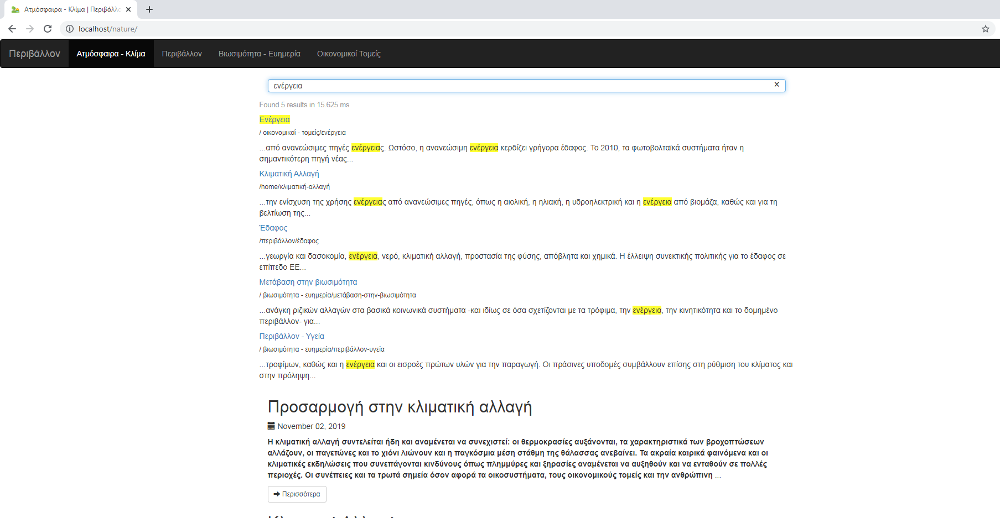

                                              Nature Blog
                                              
A Web blog where the user is able to get valuable information about several factors of human activity that affect nature. These factors are grouped into headers and are displayed into menus. A search bar is added into all menus in order to find specific results via keywords regarding these factors of nature.

This app has been made via [Bootstrap](https://getbootstrap.com/), [font awesome icons](https://fontawesome.com/), [markdown](https://www.markdownguide.org/) and [GravCMS](https://getgrav.org/).

**General view**

**Specific view**

**Search results**

