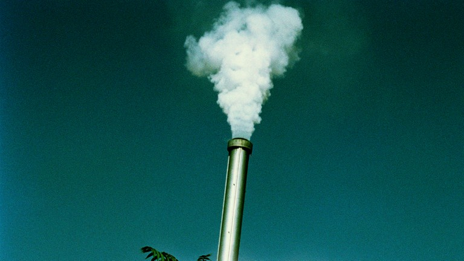

**Η ατμοσφαιρική ρύπανση βλάπτει την υγεία του ανθρώπου και το περιβάλλον. Στην Ευρώπη, οι εκπομπές πολλών ατμοσφαιρικών ρύπων έχουν μειωθεί σημαντικά τις τελευταίες δεκαετίες με αποτέλεσμα τη βελτίωση της ποιότητας της ατμόσφαιρας στην περιοχή. Ωστόσο, οι συγκεντρώσεις ατμοσφαιρικών ρύπων παραμένουν σε υπερβολικά υψηλό επίπεδο και τα προβλήματα ποιότητας του αέρα εξακολουθούν να υπάρχουν. Σημαντικό ποσοστό του ευρωπαϊκού πληθυσμού κατοικεί σε περιοχές, ιδιαίτερα σε πόλεις, όπου παρουσιάζονται υπερβάσεις στα πρότυπα ποιότητας του αέρα: το όζον, το διοξείδιο του αζώτου και τα αιωρούμενα σωματίδια (ΑΣ) ενέχουν σοβαρούς κινδύνους για την υγεία. Πολλές χώρες έχουν υπερβεί ένα ή περισσότερα από τα όρια εκπομπών του 2010 για τέσσερις σημαντικούς ατμοσφαιρικούς ρύπους. Ως εκ τούτου, το θέμα της ατμοσφαιρικής ρύπανσης παραμένει σημαντικό.**

Η ατμοσφαιρική ρύπανση είναι ένα τοπικό πρόβλημα όλης της Ευρώπης και του βόρειου ημισφαιρίου. Οι ατμοσφαιρικοί ρύποι που εκλύονται σε μία χώρα ενδέχεται να μεταφερθούν στην ατμόσφαιρα και να επιδεινώσουν ή να καταστήσουν κακή την ποιότητα του αέρα σε μια άλλη περιοχή.

Τα αιωρούμενα σωματίδια, το διοξείδιο του αζώτου και το τροποσφαιρικό όζον αναγνωρίζονται πλέον κατά κανόνα ως οι τρεις σημαντικότεροι ρύποι από την άποψη των επιπτώσεων για την υγεία. Η μακροχρόνια και οξεία έκθεση σε αυτούς τους ρύπους ενδέχεται να προκαλέσει επιπτώσεις κυμαινόμενης βαρύτητας για την υγεία, από προσβολή του αναπνευστικού συστήματος έως πρόωρο θάνατο. Περίπου 90% του ευρωπαϊκού αστικού πληθυσμού εκτίθεται σε συγκεντρώσεις ρύπων που υπερβαίνουν τα όρια ποιότητας του αέρα τα οποία κρίνονται επιβλαβή για την ανθρώπινη υγεία. Παραδείγματος χάριν, τα λεπτόκοκκα αιωρούμενα σωματίδια (ΑΣ2.5) στον αέρα έχει υπολογισθεί ότι μειώνουν το προσδόκιμο ζωής στην ΕΕ κατά περισσότερο από οχτώ μήνες. Το βενζο-a-πυρένιο  είναι καρκινογόνος ρύπος που προκαλεί ολοένα και μεγαλύτερη ανησυχία και, σε ορισμένες αστικές περιοχές, ιδιαίτερα της και κεντρικής και νότιας Ευρώπης, βρίσκεται σε συγκεντρώσεις πάνω από το όριο που έχει τεθεί για την προστασία της ανθρώπινης υγείας.

> Η ατμοσφαιρική ρύπανση είναι επιβλαβής για την υγεία μας και τα οικοσυστήματα. Μεγάλο τμήμα του πληθυσμού δεν ζει σε υγιές περιβάλλον, σύμφωνα με τα τρέχοντα πρότυπα. Για  μια βιώσιμη πορεία, η Ευρώπη πρέπει να είναι φιλόδοξη και να μην περιορίζεται στις τρέχουσες νομοθετικές ρυθμίσεις.

Η ατμοσφαιρική ρύπανση καταστρέφει επίσης το περιβάλλον μας.

- Η οξίνιση μειώθηκε σημαντικά την περίοδο 1990-2010 σε περιοχές της Ευρώπης με ευαίσθητα οικοσυστήματα που έχουν υποστεί όξινες εναποθέσεις πλεονάζοντος θείου και αζωτούχων ενώσεων.
- Ο ευτροφισμός, ένα περιβαλλοντικό πρόβλημα που οφείλεται στην απόρριψη πλεοναζόντων θρεπτικών στοιχείων στα οικοσυστήματα, σημείωσε μικρότερη πρόοδο. Η έκταση των ευαίσθητων οικοσυστημάτων που προσβάλλονταν από το πλεονάζον ατμοσφαιρικό άζωτο μειώθηκε ελάχιστα μεταξύ του 1990 και του 2010.
- Οι ζημιές σε καλλιέργειες προκαλούνται από έκθεση σε υψηλές συγκεντρώσεις όζοντος. Οι περισσότερες γεωργικές καλλιέργειες εκτίθενται σε επίπεδα όζοντος που υπερβαίνουν τον μακροπρόθεσμο στόχο της ΕΕ για την προστασία της βλάστησης. Περιλαμβάνεται κυρίως σημαντικό τμήμα των γεωργικών περιοχών, ιδιαίτερα στη νότια, κεντρική και ανατολική Ευρώπη.

Η ποιότητα του αέρα της Ευρώπης δεν βελτιώνεται πάντα με βάση τη γενική μείωση των ανθρωπογενών εκπομπών ατμοσφαιρικών ρύπων. Οι λόγοι για το εν λόγω φαινόμενο είναι πολύπλοκοι:
- δεν υπάρχει πάντα σαφής γραμμική σχέση ανάμεσα στις μειούμενες εκπομπές και τις συγκεντρώσεις ατμοσφαιρικών ρύπων στον αέρα,
- το πρόβλημα της μεταφοράς ατμοσφαιρικών ρύπων σε μεγάλη απόσταση από άλλες χώρες του βόρειου ημισφαιρίου στην Ευρώπη οξύνεται διαρκώς.

Ως εκ τούτου, εξακολουθούν να απαιτούνται στοχοθετημένες προσπάθειες μείωσης των εκπομπών για περαιτέρω προστασία της υγείας του ανθρώπου και του περιβάλλοντος στην Ευρώπη.