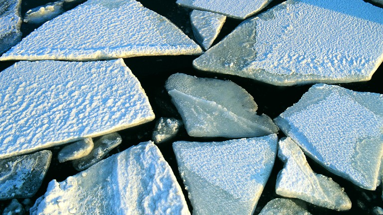

**Η κλιματική αλλαγή συντελείται ήδη: οι θερμοκρασίες αυξάνονται, τα χαρακτηριστικά των βροχοπτώσεων αλλάζουν, οι παγετώνες και το χιόνι λιώνουν και η παγκόσμια μέση στάθμη της θάλασσας ανεβαίνει. Η αύξηση της θερμοκρασίας οφείλεται πιθανότατα κατά κύριο λόγο στην παρατηρούμενη αύξηση των ατμοσφαιρικών συγκεντρώσεων αερίων θερμοκηπίου ως αποτέλεσμα των εκπομπών που προέρχονται από ανθρώπινες δραστηριότητες. Για να μετριάσουμε τις συνέπειες της κλιματικής αλλαγής, πρέπει να μειώσουμε αυτές τις εκπομπές ή να διασφαλίσουμε την πρόληψη της παραγωγής τους.**

Για να διασφαλίσουν την πρόληψη της εκδήλωσης δυσμενέστερων συνεπειών της κλιματικής αλλαγής, οι χώρες που υπέγραψαν τη σύμβαση-πλαίσιο των Ηνωμένων Εθνών για την κλιματική αλλαγή (σύμβαση UNFCCC) συμφώνησαν να περιορίσουν την παγκόσμια μέση αύξηση της επιφανειακής θερμοκρασίας από την προβιομηχανική εποχή σε λιγότερο από 2 °C. Για να επιτευχθεί αυτός ο στόχος, οι παγκόσμιες εκπομπές αερίων θερμοκηπίου πρέπει να κορυφωθούν το συντομότερο δυνατό και να μειωθούν με ταχύ ρυθμό στη συνέχεια. Οι παγκόσμιες εκπομπές θα πρέπει μέχρι το 2050 να μειωθούν κατά 50 % σε σύγκριση με τα επίπεδα του 1990 προκειμένου να επιτευχθεί ουδέτερο ισοζύγιο άνθρακα πριν από το τέλος του αιώνα. Η ΕΕ στηρίζει τον στόχο της σύμβασης UNFCCC και επιδιώκει, μέχρι το 2050, να έχει μειώσει τις εκπομπές αερίων θερμοκηπίου κατά 80 – 95 % σε σύγκριση με τα επίπεδα του 1990. Τα σημαντικά αυτά επίπεδα μείωσης λαμβάνουν υπόψη τις μικρότερες μειώσεις που απαιτούνται από τις αναπτυσσόμενες χώρες.

### Εισαγωγή ###

Τα αέρια του θερμοκηπίου εκπέμπονται μέσω φυσικών διεργασιών και ανθρώπινων δραστηριοτήτων. Το σημαντικότερο φυσικό αέριο θερμοκηπίου στην ατμόσφαιρα είναι οι υδρατμοί. Ωστόσο, οι ανθρώπινες δραστηριότητες παράγουν μεγάλες ποσότητες και άλλων αερίων θερμοκηπίου προκαλώντας αύξηση των συγκεντρώσεων αυτών των αερίων στην ατμόσφαιρα, τα οποία συντελούν με τη σειρά τους στο φαινόμενο του θερμοκηπίου και στην αύξηση της θερμοκρασίας του πλανήτη. Οι κύριες πηγές των αερίων θερμοκηπίου που προκαλούνται από τον άνθρωπο είναι:

- καύση ορυκτών καυσίμων (άνθρακας, πετρέλαιο και αέριο) για την παραγωγή ηλεκτρικής ενέργειας, τις μεταφορές, τη βιομηχανία και τα νοικοκυριά (CO2)·
- γεωργία (CH4) και αλλαγές στη χρήση γης, όπως η αποψίλωση των δασών (CO2)·
- υγειονομική ταφή απορριμμάτων (CH4)·
- χρήση βιομηχανικών φθοριούχων αερίων.

### Πολιτικές της ΕΕ ###

Διάφορες πρωτοβουλίες της ΕΕ στοχεύουν στον περιορισμό των εκπομπών αερίων του  θερμοκηπίου. Αφότου πέτυχε τους στόχους της στο πλαίσιο του Πρωτοκόλλου του Κιότο για την περίοδο 2008-2012, η ΕΕ υιοθέτησε τον στόχο να μειώσει μέχρι το 2020 τις εκπομπές της όσον αφορά τα αέρια του θερμοκηπίου κατά 20 % σε σύγκριση με τα επίπεδα του 1990. Για να επιτευχθεί αυτό —ένας από τους κύριους στόχους της στρατηγικής Ευρώπη 2020— έχει θεσπιστεί ένα ανώτατο όριο για το σύστημα εμπορίας δικαιωμάτων εκπομπών (ΣΕΔΕ) της ΕΕ σε επίπεδο Ένωσης, ενώ επιμέρους εθνικοί στόχοι για τις εκπομπές σε τομείς που δεν καλύπτονται από το ΣΕΔΕ θεσπίστηκαν στο πλαίσιο της απόφασης για τον επιμερισμό των προσπαθειών. Την ίδια στιγμή, η ΕΕ έχει εκδώσει νομοθεσία για την ενίσχυση της χρήσης ενέργειας από ανανεώσιμες πηγές, όπως η αιολική, η ηλιακή, η υδροηλεκτρική και η ενέργεια από βιομάζα, καθώς και για τη βελτίωση της ενεργειακής αποτελεσματικότητας μιας σειράς εξοπλισμών και οικιακών συσκευών. Η ΕΕ στοχεύει επίσης στη στήριξη της ανάπτυξης των τεχνολογιών δέσμευσης και αποθήκευσης άνθρακα για την παγίδευση και την αποθήκευση του CO2 που εκπέμπεται από σταθμούς παραγωγής και άλλες μεγάλες εγκαταστάσεις.

Στο πλαίσιο των πολιτικών για το κλίμα και την ενέργεια, η ΕΕ έχει δεσμευτεί να μειώσει μέχρι το 2030 τις εκπομπές στην επικράτειά της κατά τουλάχιστον 40% σε σύγκριση με τα επίπεδα του 1990. Αυτός είναι ένας δεσμευτικός στόχος. Η Ευρωπαϊκή Ενεργειακή Ένωση, σκοπός της οποίας είναι να διασφαλίσει ότι η Ευρώπη διαθέτει ασφαλή, οικονομικά προσιτή και φιλική προς το περιβάλλον ενέργεια, έχει τον ίδιο στόχο.