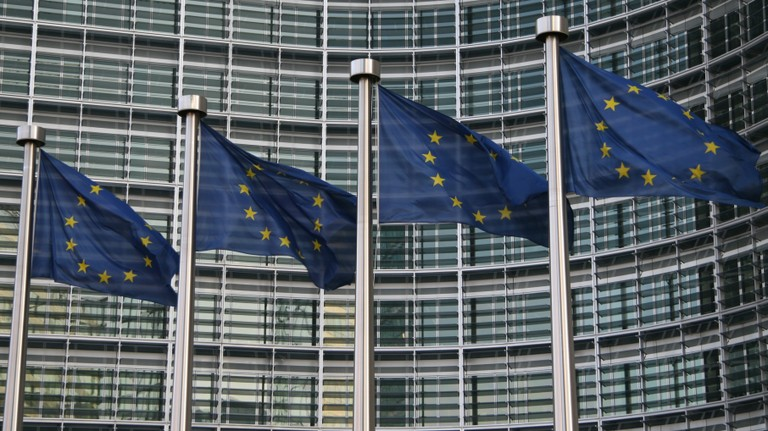

**Οι πολιτικές διαδραματίζουν κεντρικό ρόλο στη διαμόρφωση, αλλά και στη βελτίωση της κατάστασης του περιβάλλοντός μας. Οι ευρωπαϊκές περιβαλλοντικές πολιτικές έχουν εξελιχθεί σημαντικά από τη θέσπιση του πρώτου Προγράμματος Δράσης για το Περιβάλλον το 1973. Έκτοτε, έχουν εγκριθεί εκατοντάδες νομικές πράξεις για την αντιμετώπιση περιβαλλοντικών ζητημάτων.**

Όταν εκπονήθηκαν οι πρώτες ευρωπαϊκές περιβαλλοντικές πολιτικές, πολλά μέσα πολιτικής εστίαζαν σε συγκεκριμένα περιβαλλοντικά προβλήματα. Επειδή κανένα μεμονωμένο μέσο πολιτικής δεν μπορεί να δώσει λύσεις σε όλα τα προβλήματα, το φάσμα των πολιτικών σταδιακά διευρύνθηκε ώστε να αντιμετωπίζονται όλο και πιο σύνθετα περιβαλλοντικά ζητήματα και προβλήματα που σχετίζονται με την υγεία. Σήμερα γίνεται συνδυασμός πολλών παρεμβάσεων στον τομέα της περιβαλλοντικής πολιτικής:

- παραδοσιακές κανονιστικές προσεγγίσεις, τα λεγόμενα και «μέτρα διοίκησης και ελέγχου» (π.χ. πρότυπα εκπομπών, διατάξεις απαγόρευσης τοξικών ουσιών και μέσα χωροταξικού σχεδιασμού)
- αγορακεντρικά μέσα (όπως οι περιβαλλοντικοί φόροι και η εµπορία δικαιωμάτων εκποµπής αερίων θερμοκηπίου)
- ευαισθητοποίηση (εδώ περιλαμβάνονται, π.χ., οι ετικέτες ενεργειακής απόδοσης και οι ενημερωτικές εκστρατείες)

Το πιο πρόσφατο Πρόγραμμα Δράσης για το Περιβάλλον της Ευρωπαϊκής Ένωσης, το 7ο ΠΔΠ, θεσπίζει ένα ολοκληρωμένο πλαίσιο για αυτές τις παρεμβάσεις σε επίπεδο πολιτικής. Θέτει τον μακρόπνοο φιλόδοξο στόχο της «ευημερίας εντός των ορίων του πλανήτη μας».

### Αξιολόγηση των περιβαλλοντικών πολιτικών για το τι είναι αποτελεσματικό ###

Έχουμε ήδη διανύσει περίπου το ήμισυ του διαστήματος από την πρώτη θέσπιση περιβαλλοντικής πολιτικής σε ευρωπαϊκό επίπεδο, στις αρχές της δεκαετίας του 1970, έως τον στόχο του 2050 για την επίτευξη της βιωσιμότητας, όπως ορίζεται από το 7ο ΠΔΠ. Η ευρωπαϊκή περιβαλλοντική πολιτική αναγνωρίζεται ως μία από τις ισχυρότερες παγκοσμίως. Το περιβάλλον μας θα έδειχνε πολύ διαφορετικό χωρίς αυτή, όπως καταδεικνύει η τελευταία έκθεση εκτίμησης του Ευρωπαϊκού Οργανισμού Περιβάλλοντος (ΕΟΠ) «Το ευρωπαϊκό περιβάλλον — κατάσταση και προοπτικές 2015». Παράλληλα με αυτές τις εκτιμήσεις, μπορούν να τεθούν ερωτήματα όπως «τι είναι αποτελεσματικό;», «με ποιο τρόπο είναι αποτελεσματικό;», «πόσο κοστίζει;» και «ποιες είναι οι προϋποθέσεις για να είναι αποτελεσματικό;» με στόχο τη βελτίωση της περιβαλλοντικής πολιτικής, τόσο σε επίπεδο εφαρμογής όσο και σχεδιασμού. Η αξιολόγηση των πολιτικών βοηθά να δοθούν απαντήσεις σε αυτά τα ερωτήματα.

Οι αξιολογήσεις υιοθετούν συνήθως διάφορα κριτήρια. Τα κριτήρια αυτά συχνά αφορούν τη συνάφεια των πολιτικών, την αποτελεσματικότητα και αποδοτικότητα, καθώς και τη συνεκτικότητά τους, αλλά και την προστιθέμενη αξία των πολιτικών σε ευρωπαϊκό, εθνικό ή τοπικό επίπεδο. Πιο πρόσφατα, η συνάφεια αυτών των κριτηρίων αναγνωρίστηκε στο πλαίσιο των πρωτοβουλιών της ΕΕ για τη βελτίωση του κανονιστικού πλαισίου, της λεγόμενης «καλύτερης νομοθέτησης» (Better Regulation). Υπάρχουν διάφορα εργαλεία και μέθοδοι για την αξιολόγηση των περιβαλλοντικών πολιτικών ως προς τα κριτήρια αυτά, όπως, π.χ. το «Evalsed sourcebooken» της Επιτροπής.