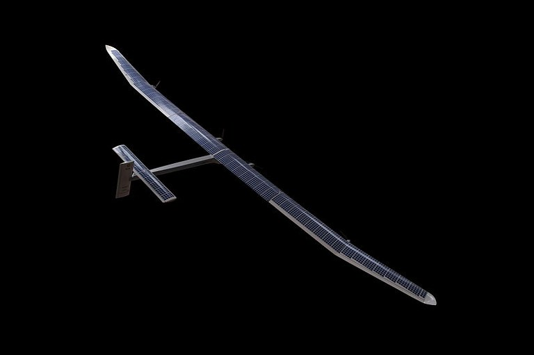

**Στην πενταετή του βασική έκθεση, Το ευρωπαϊκό περιβάλλον - Κατάσταση και προοπτικές (SOER) 2015, ο Ευρωπαϊκός Οργανισμός Περιβάλλοντος (EΟΠ) κατέληξε στη διαπίστωση ότι, παρά τις βελτιώσεις κατά τις πρόσφατες δεκαετίες, οι περιβαλλοντικές προοπτικές της Ευρώπης είναι ανησυχητικές. Ο παγκοσμιοποιημένος και συστημικός χαρακτήρας των μελλοντικών περιβαλλοντικών προκλήσεων καθιστά επιτακτική την ανάγκη ριζικών αλλαγών στα βασικά κοινωνικά συστήματα -και ιδίως σε όσα σχετίζονται με τα τρόφιμα, την ενέργεια, την κινητικότητα και το δομημένο περιβάλλον- για την επίτευξη των μακροπρόθεσμων στόχων βιωσιμότητας της Ευρώπης.**

