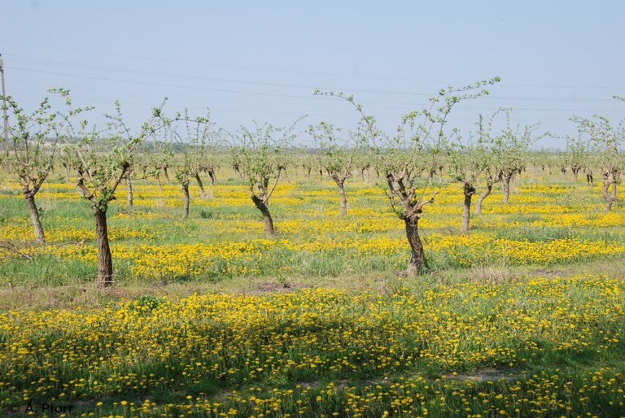

**Ο γεωργικός τομέας είναι ένας από τους κύριους χρήστες γης στην Ευρώπη, με αποτέλεσμα να διαμορφώνει τα τοπία στις αγροτικές περιοχές. Έχει διάφορες άμεσες και έμμεσες επιπτώσεις στο περιβάλλον, ενώ και ο ίδιος εξαρτάται από τους φυσικούς πόρους.**

Οι γεωργικές εκτάσεις διαδραματίζουν σημαντικό ρόλο στα πρότυπα χρήσης της γης σε ολόκληρη την ΕΕ. Οι λειμώνες και οι καλλιεργήσιμες εκτάσεις καλύπτουν συνολικά το 39 % της γης στην Ευρώπη (ΕΟΠ, 2017α). Ο γεωργικός τομέας χρησιμοποιεί μεγάλο μέρος των φυσικών πόρων και έχει πολύπλοκη σχέση με το περιβάλλον (ΟΟΣΑ, 2017). Τα ακόλουθα δεδομένα αποτυπώνουν τις επιδόσεις και τον αντίκτυπο του γεωργικού τομέα στην ΕΕ:

- Το 2015, περίπου το 94 % των εκπομπών αμμωνίας στην Ευρώπη προήλθε από τη γεωργία, κυρίως από δραστηριότητες όπως αποθήκευση κοπριάς, διασπορά υγρής κοπριάς και χρήση ανόργανων αζωτούχων λιπασμάτων.
- Οι εκπομπές CO2 από τυρφώδες έδαφος που αποστραγγίζεται για γεωργικούς σκοπούς ανέρχονται σε 100,5 Mt CO2 ετησίως, ενώ οι αντίστοιχες εκπομπές από τη δασοκομία ανέρχονται σε 67,6 Mt CO2. Με συνολικές εκπομπές από αποστραγγισμένα εδάφη οι οποίες ανέρχονται σε 173 Mt CO2, η ΕΕ είναι το δεύτερο μεγαλύτερο σημείο συγκέντρωσης εκπομπών CO2 από τυρφώνες (μετά την Ινδονησία) (Berge et al., 2017).
- Μέσω της άρδευσης, η γεωργία ασκεί σημαντική πίεση στους ανανεώσιμους υδάτινους πόρους. Σε εποχική βάση, ο τομέας καταναλώνει πάνω από το 50 % του νερού που χρησιμοποιείται στην Ευρώπη.
- Η γεωργία είναι μία από τις βασικές πηγές νιτρικών ιόντων στα επιφανειακά και υπόγεια ύδατα. Σε αρκετές περιοχές της Ευρώπης και συχνά σε περιοχές με εντατική γεωργία, οι συγκεντρώσεις νιτρικών εξακολουθούν να είναι ιδιαίτερα υψηλές.
- Περίπου το 9 % των γεωργικών εκτάσεων βρίσκεται σε τόπους Natura 2000 – ένα πανευρωπαϊκό δίκτυο περιοχών προστασίας της φύσης.
- Η γεωργία συνεισφέρει 25 εκατομμύρια τόνους ισοδύναμου πετρελαίου (12,3 %) στην παραγωγή ενέργειας από ανανεώσιμες πηγές (2015), σημειώνοντας αύξηση 15 % από το 2013 έως το 2015 (ΓΔ AGRI, 2017).
- Η γεωργία αποτελεί αναπόσπαστο μέρος των συστημάτων τροφίμων και το εύρος των τροφίμων που παράγονται στην Ευρώπη είναι ποικίλο.
- Η ΕΕ είναι γενικά αυτάρκης όσον αφορά τα περισσότερα πρωτογενή γεωργικά προϊόντα. Είναι επίσης ο μεγαλύτερος εξαγωγέας γεωργικών προϊόντων διατροφής, μεταξύ των οποίων περιλαμβάνονται μεταποιημένα τρόφιμα (EC, 2016α).
 
 

Δύο από τις κυριότερες προκλήσεις που αντιμετωπίζει η γεωργία στην Ευρώπη είναι η κλιματική αλλαγή (ΕΟΠ, 2017γ) και η δέσμευση γης, δηλαδή η μετατροπή εκτάσεων, για παράδειγμα, σε οικισμούς και υποδομές (ΕΟΠ, 2017αen). Η κλιματική αλλαγή απαιτεί την προσαρμογή των καλλιεργούμενων ποικιλιών και προκαλεί ακραία καιρικά φαινόμενα (για περισσότερες πληροφορίες σχετικά με την προσαρμογή στην κλιματική αλλαγή, βλ. τις εργασίες του ΕΟΠen σε αυτόν τον τομέα ή την πλατφόρμα Climate-ADAPT) και, ως εκ τούτου, απαιτεί ουσιαστική διαχείριση κινδύνου. Η δέσμευση γης οδηγεί στη μείωση των γεωργικών εκτάσεων σε πολλές περιοχές.