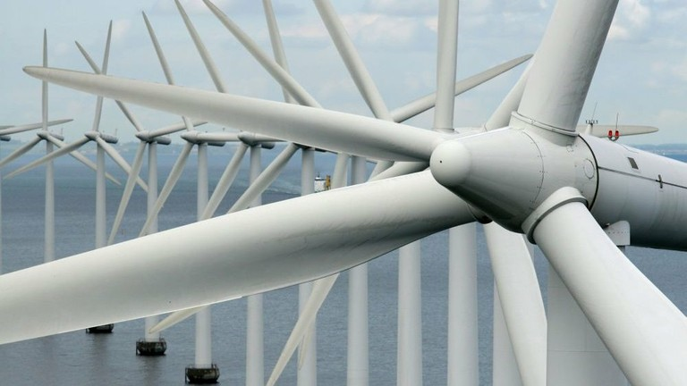

**Ουσιώδης για τη δημιουργία βιομηχανικού, εμπορικού και κοινωνικού πλούτου, η ενέργεια παρέχει, επίσης, προσωπική άνεση και κινητικότητα. Ωστόσο, η παραγωγή και η κατανάλωσή της ασκούν σημαντικές πιέσεις στο περιβάλλον: αέρια θερμοκηπίου και εκπομπές ρύπων, χρήσεις γης, δημιουργία αποβλήτων και πετρελαιοκηλίδες. Αυτές οι πιέσεις συμβάλλουν στην κλιματική αλλαγή, βλάπτουν τα φυσικά οικοσυστήματα και το ανθρωπογενές περιβάλλον, και έχουν δυσμενείς συνέπειες για την ανθρώπινη υγεία.**

Πολλές ανθρώπινες δραστηριότητες απαιτούν την καύση ορυκτών καυσίμων. Το γεγονός αυτό αυξάνει τις συγκεντρώσεις διοξειδίου του άνθρακα (CO2) στην ατμόσφαιρα, με αποτέλεσμα την κλιματική αλλαγή, ενώ επίσης αυξάνει την παγκόσμια μέση θερμοκρασία. Παγκοσμίως, η ζήτηση για ενέργεια αυξάνεται, ενισχύοντας, έτσι, την τάση για αύξηση των εκπομπών CO2.

Οι περισσότερες χώρες βασίζονται στα ορυκτά καύσιμα (πετρέλαιο, φυσικό αέριο και άνθρακα) για να ικανοποιήσουν τη ζήτηση για ενέργεια. Η καύση αυτών των καυσίμων εκλύει θερμότητα που μπορεί να μετατραπεί σε ενέργεια. Κατά τη διαδικασία αυτή, ο άνθρακας που βρίσκεται στο καύσιμο αντιδρά με το οξυγόνο, παράγοντας CO2, το οποίο απελευθερώνεται στην ατμόσφαιρα. Επίσης απελευθερώνονται ατμοσφαιρικοί ρύποι (διοξείδιο του θείου, διοξείδιο του αζώτου και σωματίδια), με επακόλουθες επιπτώσεις στην ποιότητα του αέρα. Ωστόσο, χάρη στα τεχνικά μέτρα και τις βελτιώσεις στις μονάδες παραγωγής ενέργειας και θερμότητας, οι εκπομπές αυτές έχουν μειωθεί τις τελευταίες δεκαετίες.

Το υψηλότερο σημείο ενεργειακής κατανάλωσης στην Ευρώπη καταγράφηκε το 2006. Το 2010 η κατανάλωση ενέργειας υποχώρησε κατά 4% περίπου. Αυτή η μείωση μπορεί να εξηγηθεί εν μέρει λόγω της οικονομικής κρίσης, αν και συνέβαλε επίσης η ελαφρά αποδέσμευση της οικονομικής δραστηριότητας από την κατανάλωση ενέργειας.

Τα ορυκτά καύσιμα εξακολουθούν να κυριαρχούν στο μείγμα καυσίμων: περίπου το 77% των ενεργειακών αναγκών του μέσου ευρωπαίου καλύπτεται από πετρέλαιο, φυσικό αέριο και άνθρακα. Η πυρηνική ενέργεια καλύπτει το 14%, ενώ το υπόλοιπο 9% προέρχεται από ανανεώσιμες πηγές ενέργειας. Ωστόσο, η ανανεώσιμη ενέργεια κερδίζει γρήγορα έδαφος. Το 2010, τα φωτοβολταϊκά συστήματα ήταν η σημαντικότερη πηγή νέας εγκατεστημένης ικανότητας, ενώ οι νέες εγκαταστάσεις φυσικού αερίου και αιολικές εγκαταστάσεις κατέλαβαν τη δεύτερη και τρίτη θέση αντίστοιχα. Οι μονάδες πυρηνικής ενέργειας σημείωσαν πολύ μεγαλύτερα ποσοστά παροπλισμού παρά εγκατεστημένης ικανότητας.

Ο μέσος ευρωπαίος χρησιμοποιεί 27 megawatt ανά ώρα (MWh) ετησίως, περιλαμβανομένων όλων των οικιακών, βιομηχανικών και μεταφορικών πηγών. Το μέγεθος αυτό ποικίλλει σημαντικά από χώρα σε χώρα, ενώ το ίδιο ισχύει και για τις σχετικές εκπομπές CO2, οι οποίες εξαρτώνται άμεσα από τη διείσδυση της ανανεώσιμης και της πυρηνικής ενέργειας. Οι μεταφορές, ο τομέας με την ταχύτερη αύξηση ενεργειακής κατανάλωσης από το 1990, βρίσκονται πλέον στην κορυφή της ενεργειακής κατανάλωσης.

### Πολιτικές της ΕΕ ###

Η ενέργεια αποτελεί ολοένα υψηλότερη προτεραιότητα πολιτικής. Αποτελεί έναν από τους πέντε κύριους τομείς ανάπτυξης στους οποίους στοχεύειen η στρατηγική "Europe 2020" στους εξής στόχους της:

- 20 % της ενεργειακής κατανάλωσης της Ευρώπης από ανανεώσιμη ενέργεια,
- 20 % αύξηση στην ενεργειακή αποδοτικότητα.
- 
Παράλληλα με τους συγκεκριμένους στόχους της Ενεργειακής Στρατηγικής 2020, υπάρχουν διάφορες πολιτικές που εξετάζουν πρόσθετους τομείς ενδιαφέροντος, οι οποίες συνοψίζονται στον διαδικτυακό τόπο της Ευρωπαϊκής Επιτροπής. Οι πολιτικές περιλαμβάνουν:

- βελτίωση της ασφάλειας του εφοδιασμού,
- διασφάλιση ανταγωνιστικότητας της ευρωπαϊκής οικονομίας και της διαθεσιμότητας προσιτής ενέργειας,
- παρότρυνση για την ανάπτυξη μιας ανταγωνιστικής εσωτερικής αγοράς ενέργειας,
- καθορισμός ελάχιστων επιπέδων φορολόγησης της ενέργειας.